# SeLNA v2  
#### High performance, low cost filtered LNA 

Naming scheme, serial numbers
  
    
v2.a.b  
v2 = SeLNA v2
a = filter count   
b = revision  
v2.2.6 = double filtered SeLNA v2, revision 6  

2.a.b.cccc.dddd  
2 = SeLNA v2  
a = filter count  
b = revision  
cccc = center frequency  
dddd = board SN  
2.2.6.1680.0021 = double filtered SeLNA v2, revision 6, 1680 MHz center frequency, board number 21  

Specs
  

Frequency range: 100 ... 3600 MHz (filter dependent)  
Supply voltage: 3.15 ... 5.25 V  
Supply current: typ. 140 mA @ 5 V   
Operating temperature: -30 ... +75°C (case)  
Storage temperature: -40 ... +85°C  
Noise figure: typ. 0.45...0.6dB (L-band, v2.1.5)   
50Ω matched input/output  

## Assembly  

Done soldering? Received a sample? Here's a "quick" start guide.

  
### Step 1 - cleanup and preparing the components
SeLNA v2 uses chinese bias tee enclosure, as that was the cheapest option to include connectors, lid and the screws. You can easily find it on aliexpress by searching for "RF bias tee".  
After reflow soldering the board, it's recommended to wash it with isopropyl alcohol or other electronics-safe solvent to remove any flux and solder residues.  
SMA connector probes need to be shortened to 2 ±0.25 mm, teflon insulator should be flush with the inner enclosure surface.

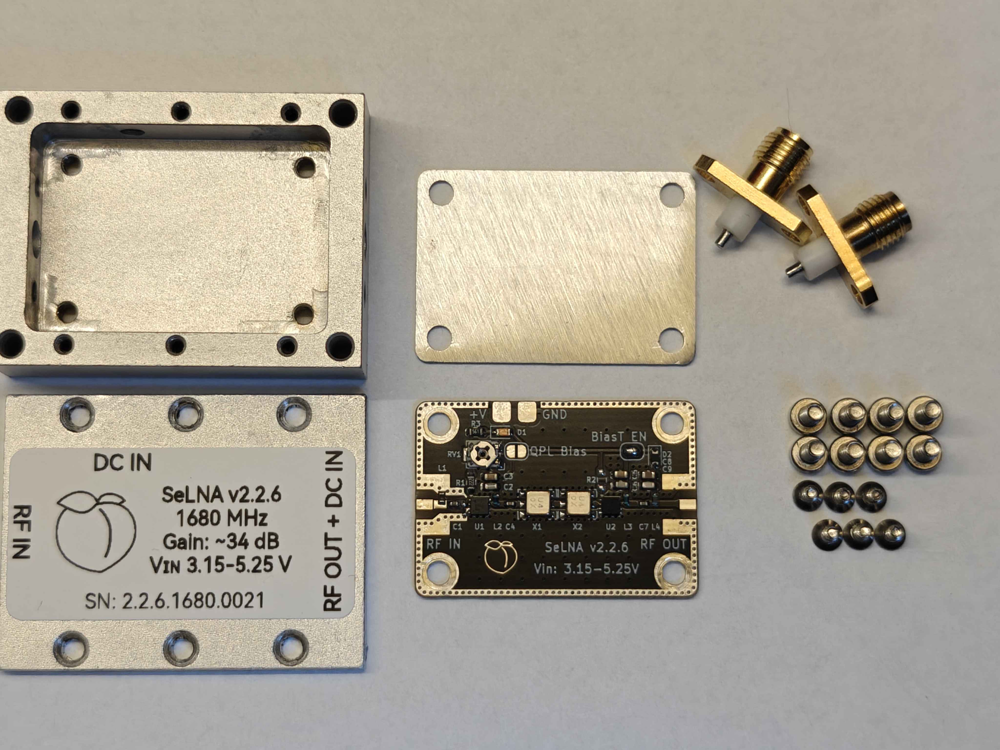

Chinese enclosures vary in quality and dimensions. There seem to be three versions of the enclosure - two of them require a 0.8 mm spacer under the PCB.
If the clearance between SMA probe and PCB looks like this, you need to add a spacer:

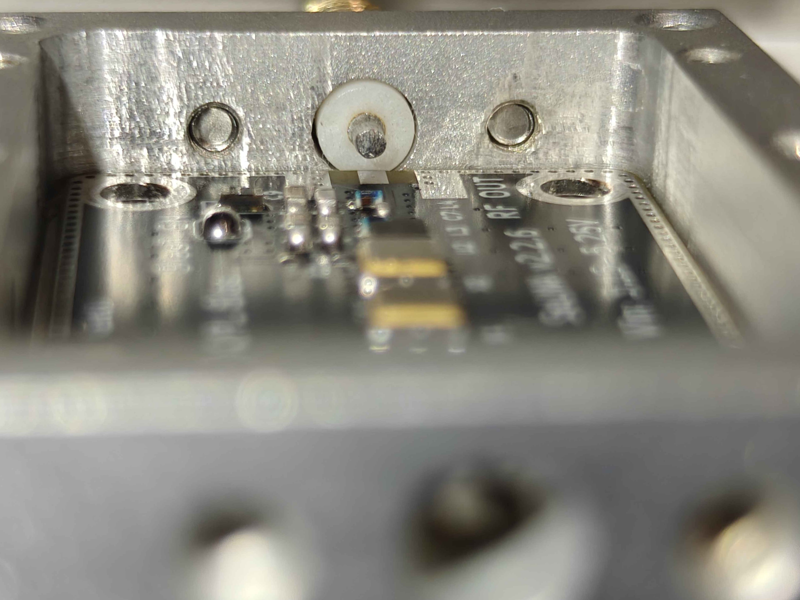

If there's any manufacturing defects like these:

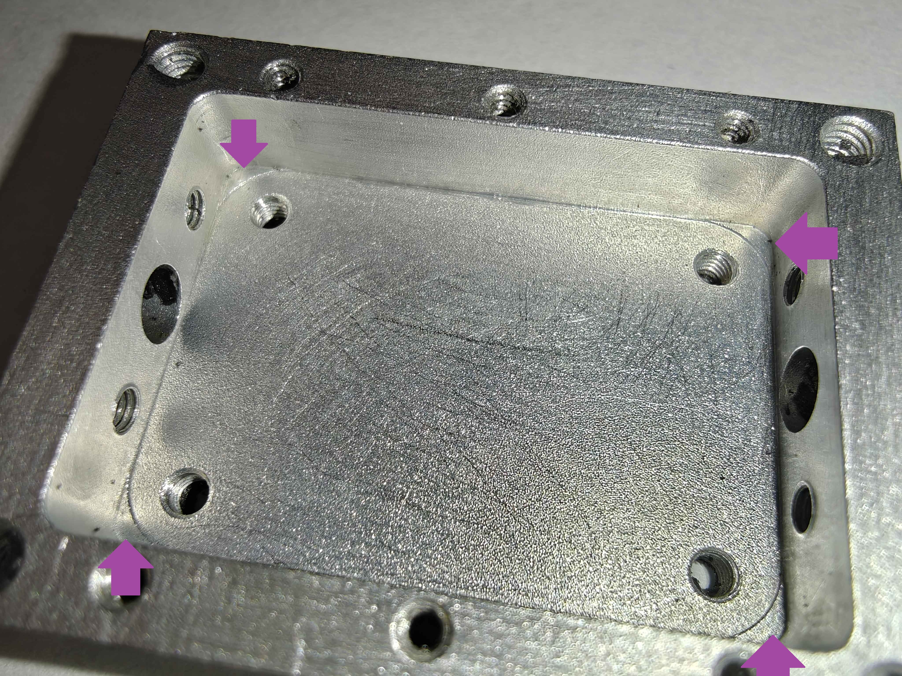

You will need to either grind/mill them down manually, or adjust the spacer to fit around the raised edges.  
If there are no manufacturing defects, and the SMA probe clearance looks like this - you can move to the next step:

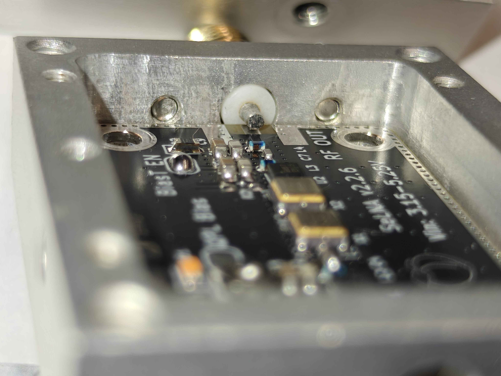

Which is... making sure the enclosure is conductive. Quick multimeter continuity test will tell, without pushing down on the probes. Some of the enclosures arrive anodized, you will need to get rid of this coating at least under SMA connectors and under the PCB. Either sanding or etching in 5-10% NaOH works, remember about all safety precautions when working with corrosive substances, or with aluminum dust!

### Step 2 - measuring and setting first stage bias current

Set your power supply to 5.0V, connect the ground to the PCB ground, and positive to a positive lead of your multimeter.  
Set it to DC current measurement, <200mA range. Probe "QPL Bias" pad with the other lead as shown.  

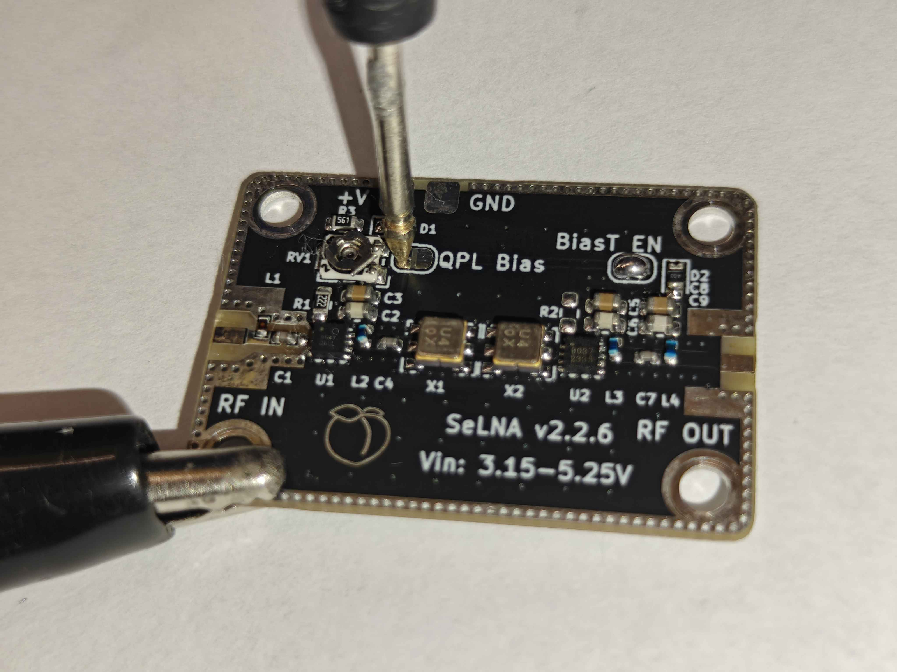

Using the potentiometer, set the bias current to 65mA. Once the bias current is set, you can solder the "QPL Bias" jumper. Solder the "BiasT EN" jumper as well if you wish to enable bias tee power for your LNA.

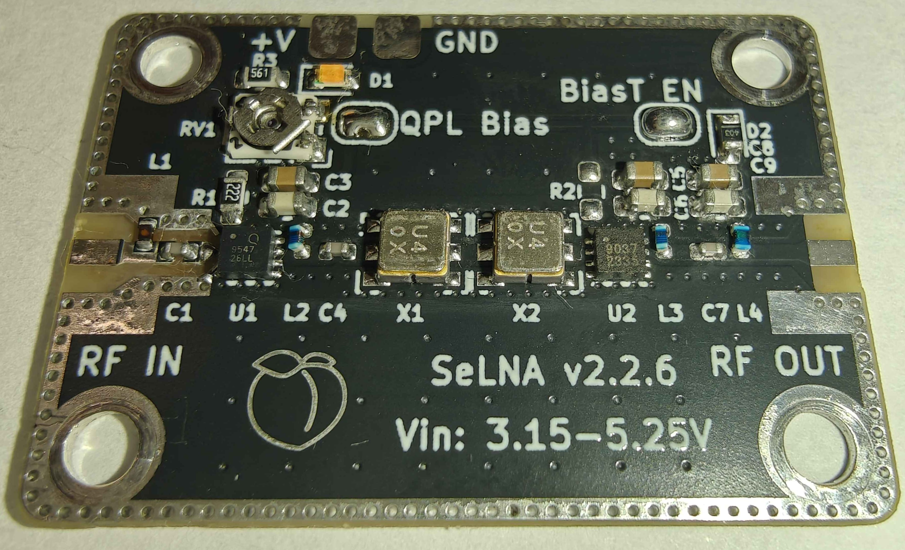

### Step 3 - installing the PCB and connectors

Start with dropping the PCB (or spacer and then PCB) inside the enclosure. Install all 4 mounting bolts, without tightening them for now.  
If you'd like to weatherproof your LNA, now is the time to apply a thin layer of sealant on SMA connector mating surfaces (and in their bolt holes).
Insert both SMA connectors, install their mounting bolts (without tightening for now).  
Gently press down on the connector:  
  
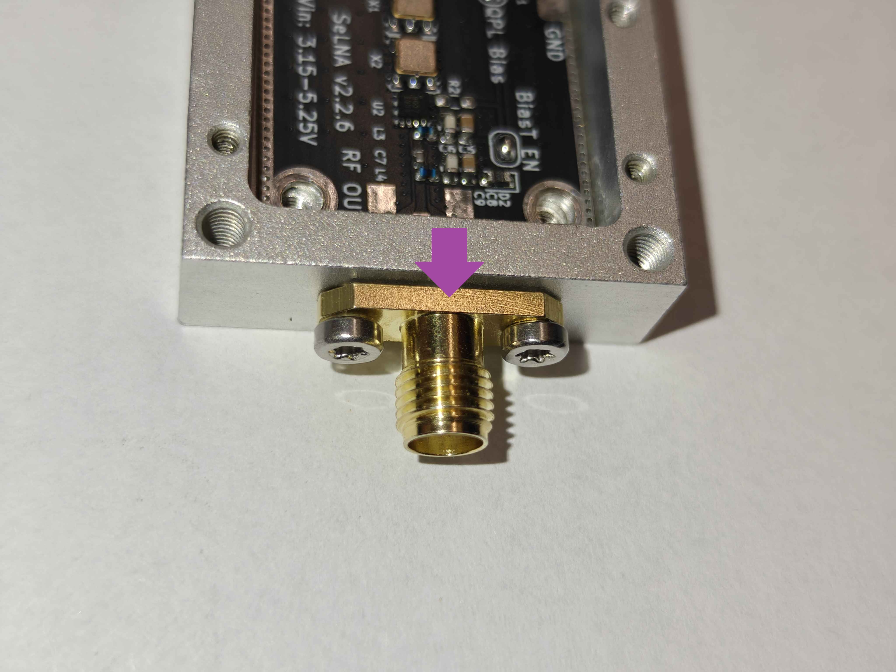

and torque the mounting bolts to 0.4 Nm (40 Ncm).
Once the connectors are secured, you can start aligning the PCB with SMA probes.  

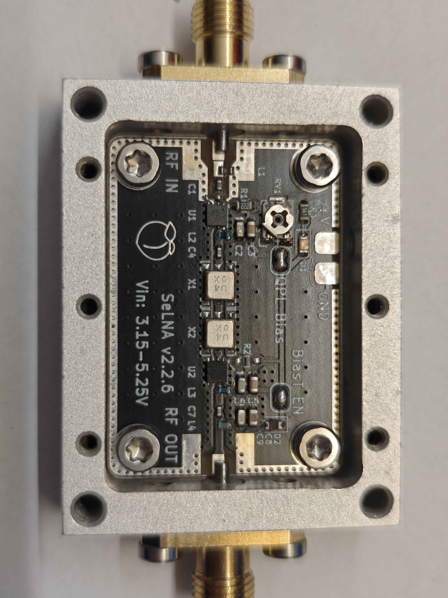

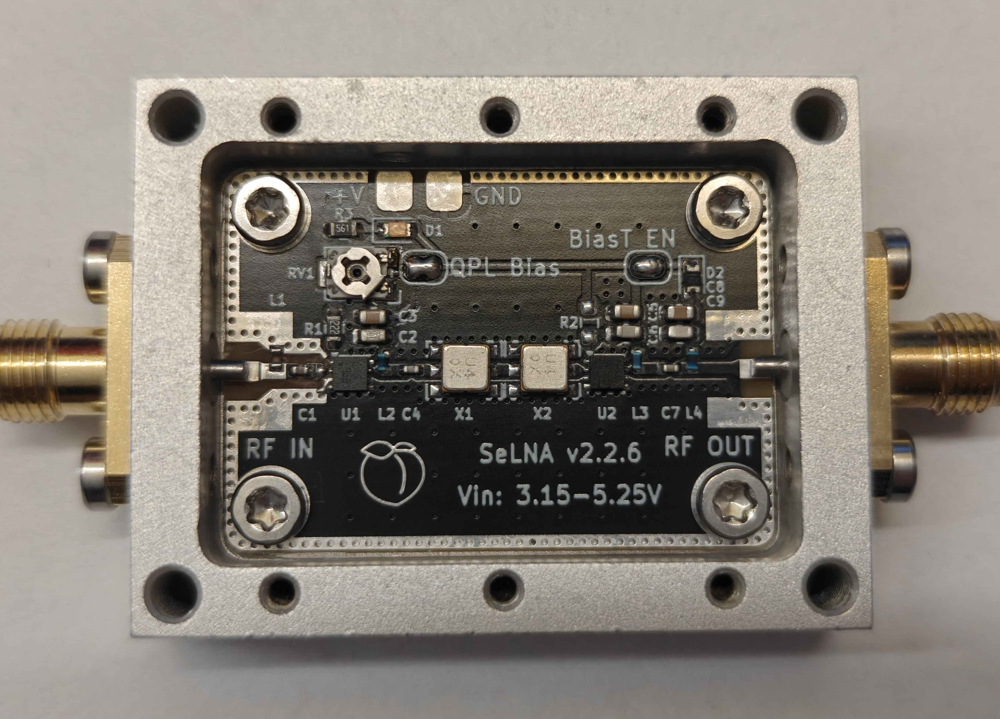

Once aligned, torque the mounting bolts to 0.4 Nm (40 Ncm).  
Now you can solder the SMA probes to the PCB. Once soldered, they should look like this:  

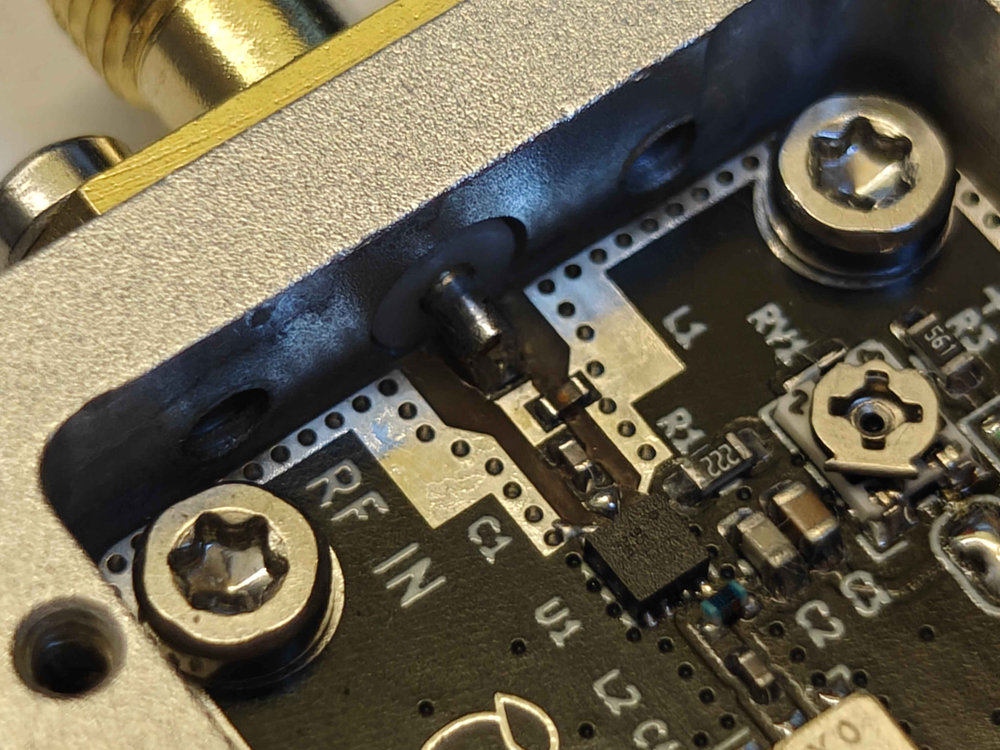

and definitely not like this:

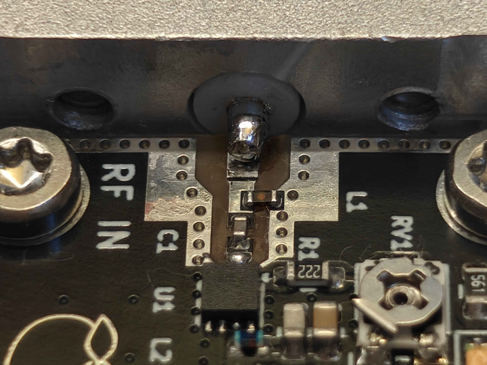

If you'd like to power your LNA externally, install the dc pass-trough now. Otherwise install an M3x4 plug.
If you chose to weatherproof your LNA, apply thin layer of sealant on the lid mating surface, and over the PCB mounting holes (from the outside).
You can install the lid afterwards.

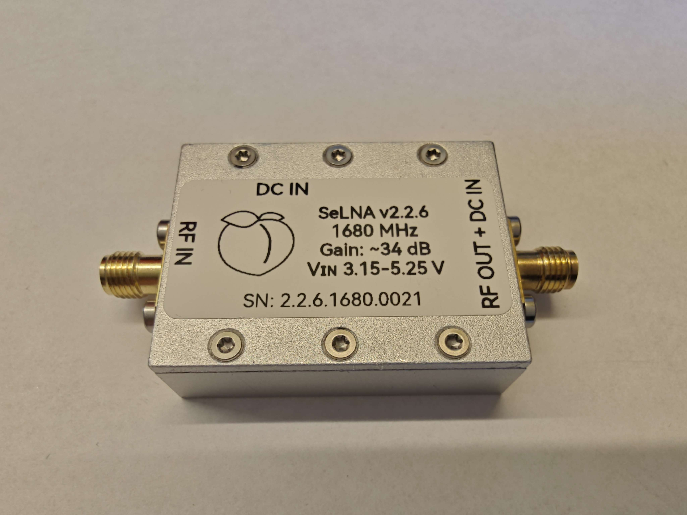

